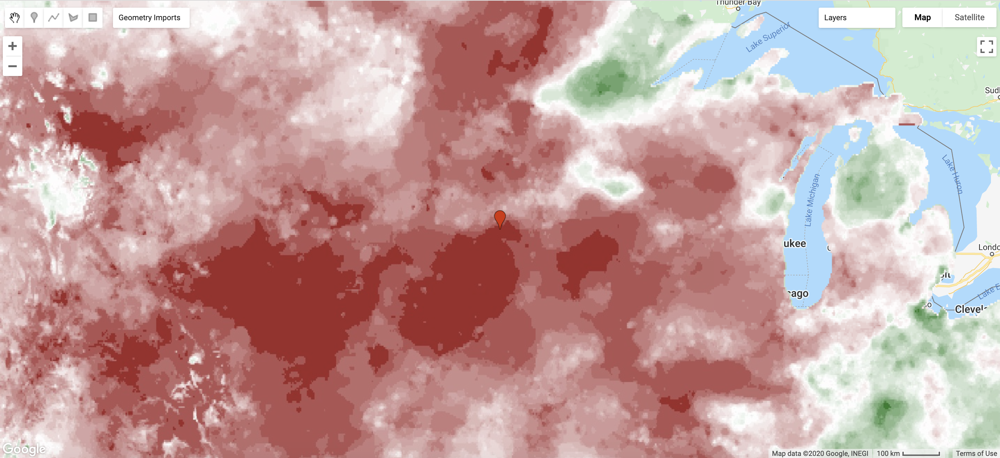
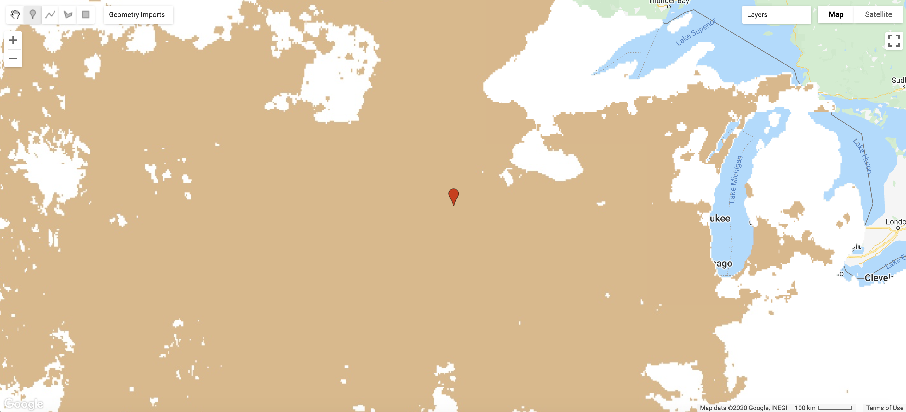
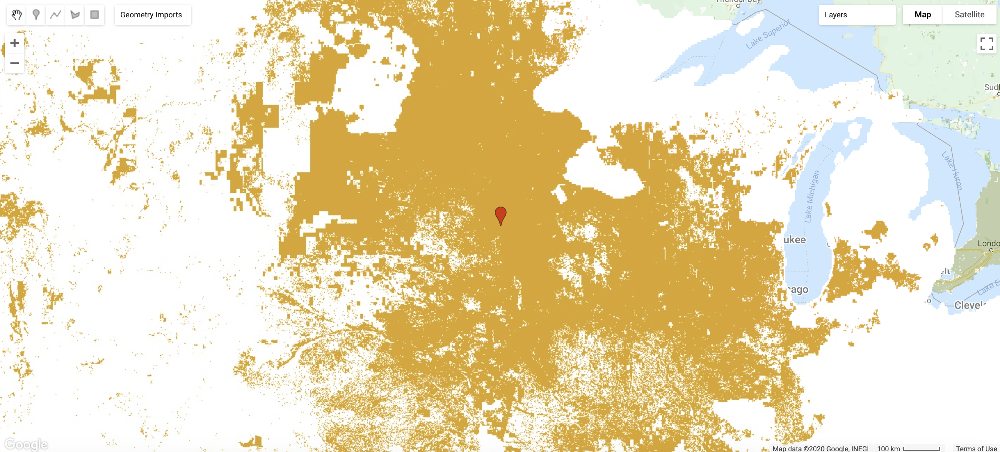
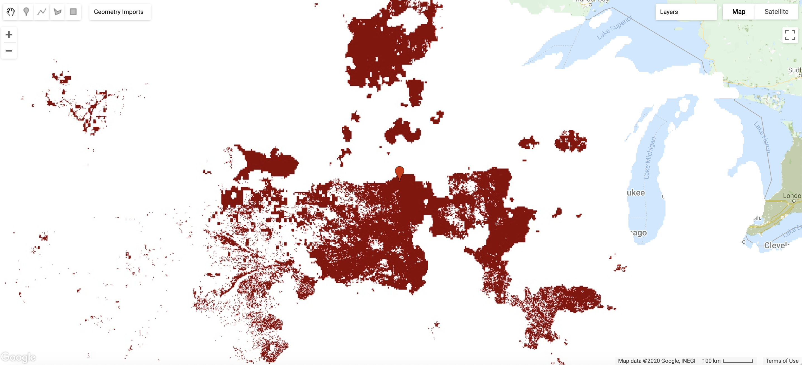

# Identifying US Cropland that is Vulnerable to Drought

This Google Earth Engine tutorial uses two raster datasets to identify agricultural areas in the continental US that are vulnerable to drought. This analysis uses cropland data to identify cropland that is rainfed (vs. irrigated), and a drought index to identify areas that are experiencing dry or drought conditions. 

### The Data

The [GFSAD dataset](https://developers.google.com/earth-engine/datasets/catalog/USGS_GFSAD1000_V1)  from the Global Food-Security Suppport Analysis Data Project maps where global cropland is rainfed or irrigated. 
> The GFSAD is a NASA-funded project to provide high-resolution global cropland data and their water use that contributes towards global food security in the twenty-first century. The GFSAD products are derived through multi-sensor remote sensing data (e.g., Landsat, MODIS, AVHRR), secondary data, and field-plot data and aims at documenting cropland dynamics.

The GFSAD data contains 6 categories: 

> 0 - non-croplands
> 
> 1 - Croplands: irrigation major
> 
> 2 - Croplands: irrigation minor 
> 
> 3 - Croplands: rainfed
> 
> 4 - Croplands: rainfed, minor fragments
> 
> 5 - Croplands: rainfed, very minor fragments
> 


The [GRIDMET DROUGHT: CONUS Drought Incides](https://developers.google.com/earth-engine/datasets/catalog/GRIDMET_DROUGHT) provides multiple drought indices at 4km resolution. This tutorial uses the standardised precipitation index (SPI), which follows the follwing breakdown: 

> 2.0 or more (extremely wet)
>
> 1.6 to 1.99 (very wet)
>
> 1.3 to 1.59 (moderately wet),
> 
> 0.8 to 1.29 (slightly wet)
> 
> 0.5 to 0.79 (incipient wet spell)
> 
> -0.49 to 0.49(near normal),
> 
> -0.79 to -0.5 (incipient dry spell)
> 
> -1.29 to -0.8 (mild drought)
> 
> -1.59 to -1.3 (moderate drought)
> 
> -1.99 to -1.6 (severe drought)
> 
> -2.0 or less (extreme drought).


## Mapping Cropland Data 

Begin by importing the Cropland data as a GEE image. 

```
// Import Cropland Data 
var crop = ee.Image('USGS/GFSAD1000_V1');
```
Next, we create the visualization parameters for the cropland data. The color palette used below is taken from the metadata, but feel free to change the colors. The `min` and `max` values are based on the values associated with the 6 landcover categories.  
```
// Create visualization parameters for crop layer. Color palette suggested in metadata. 
var cropMaskVis = {
  min:0, 
  max:5, 
  palette: ['black', 'orange', 'brown', '02a50f', 'green', 'yellow'],
```
Add the layer to the map, and make sure to give the layer a descriptive name to keep track of different layers as we add more throughout this tutorial. 
```
// Add crop layer to map
Map.addLayer(crop, cropMaskVis, 'Cropland')
```
The output map is a global map showing non-croplands and croplands that are either irrigated or rainfed, and should look something like this: 


To focus the extent of the map for this tutorial, we are going to zoom in on the Midwest, specifically Sioux Falls, South Dakota. 
You can do this in one of two ways. First is to use the `Add a marker` feature in the GEE map window. Add the marker to Sioux Falls, or wherever you would like to focus the map, and the geometry will automatically import as a new variable `geometry`. Rename the variable with a geographic or descriptive name. We are then going to center the map on the geometry variable using `Map.centerObject(geometry variable, zoom)`. 
```
// Center the map on the geometry variable, and set the zoom level
Map.centerObject(SiouxFalls, 5); 
```
You can also use `Map.setCenter(long,lat, zoom)` to center the map on latitude and longitude, and again set the zoom level.
```
// Center the map using lat and long
Map.setCenter(-96.7313, 43.5460, 5); 
```


#### Identifying Areas with Only Rainfed Cropland 
The cropland map is quite busy and a little hard to interpret. For the purpose of this tutorial we are interested in just the rainfed cropland, since it is more vulnerable to periods of drought. First we are going to visualize the different categories of rainfed agriculture by creating new visualization parameters. Since we are only interested in values 3, 4, and 5, we will set the minimum value at 2. This will group together all categories with values 2 and below. The palette needs four colors, one for each of the remaining rainfed categories, and one for the non-rainfed categories. Add the new map layer, and make sure to include a descriptive layer name.
```
// Color Palette for rainfed cropland 
var cropMaskVis2 = {
  min: 2.0,
  max: 5.0,
  palette: ['White', 'DarkGreen', 'SeaGreen', 'DarkSeaGreen'],
};
// Add Rainfed cropland map 
Map.addLayer(crop, cropMaskVis2, 'Rainfed Croplands, dif');
```


## Mapping Drought Data 

Begin by importing the Drought data as a GEE image collection.  

```
// Import Drought Data 
var GRIDMET = ee.ImageCollection('GRIDMET/DROUGHT');
```
Since this is an image collection, it includes images from 1980 to present (give or take a few weeks). This dataset also includes 26 bands, which cover multiple different drounght indices, and for 3 of the indices different bands represent different time scales, corresponding to time aggregation of the data. For this tutorial we are using the standard precipitation index (SPI) at a 1 year scale. The band is called `spi1y`. 

We are first going to filter the image collection by data. We do this by transforming the data from a text data `year-month-day` to a format that can be read by GEE. `dS` represents the start date and `dE` is the end date. `ee.Date` is used to convert the date into a GEE formated date. 

```
// Filter GRIDMET Image collection by date 
var dS = '2012-09-11';
var dE = '2012-09-11';
var dSUTC = ee.Date(dS, 'GMT');
var dEUTC = ee.Date(dE, 'GMT');
var filtered = GRIDMET.filterDate(dSUTC, dEUTC.advance(1, 'day'));
```
The `filtered` variable now includes images for all the bands **within the start and end dates**. 

**Choosing different dates:** The dataset is only updated every 5 (ish) days, so not all dates are valid start and end dates. Use this code to print out all dates included in the Image Collection, to choose alternative dates. 
```
// Print out all dates included in the image collection.
print(GRIDMET.aggregate_array('system:index'));
``` 
Next we are going to select a single band from the images in the `filtered` variable. As mentioned above, we are using `spi1y`
```
// Select SPI 1-year aggregated data from Image Collection 
var SPI = filtered.select('spi1y');'
```

Next, we create the visualization parameters for the SPI (1 year) data. The `min` and `max` values are based on the SPI scale included above and in the metadata. Since the data is continuous, the palette is also a continuous palette that assigns colors to the extreme and middle values (-2.5, 0, and 2.5).  
```
// Create visualization parameters for  SPI layer
var SPIColors = ['DarkRed', 'White', 'DarkGreen'];
var SPIVis = {
  min: -2.5,
  max: 2.5,
  palette: SPIColors
};
```
Add the layer to the map, and make sure to give the layer a descriptive name to keep track of different layers as we add more throughout this tutorial. 
```
// Add crop layer to map
Map.addLayer(SPI.first(), SPIVis, 'SPI-1year');
```
The output map is a map of the continental US showing areas that are 'near-normal' (shown in white), 'dry' or 'in drought' (shades of red), and 'wet' (shades of green). The map should look something like this:




Since we already centered the map on Sioux Falls above, the map automatically zooms into the Midwest. 

#### Identifying Dry Areas
In this tutorial we want to find areas of the US that are experiencing drier than usual or drought conditions. In the SPI scale, values below -0.5 represent an 'inicipient dry spell' and anything less than -1.6 is a moderate severe or extreme drought. We are going to create two new layers: one of dry areas in the US, and one of areas experiencing severe or extreme drought. 

We begin by creating two new variables `dryareas` and `droughtareas` using `.lte` (less than or equal to). 

```
// Select dry and drought areas from SPI
var dryareas = SPI.first().lte(-0.5);
var droughtareas = SPI.first().lte(-1.6);
```
We then add them to the map. Since they are both Boolean variables/maps we dont need to set min/max values for the vizualization parameters. Instead we can just set a 0/1 color palette.
```
// Add Boolean layers to map
Map.addLayer(dryareas, {palette: 'White, Burlywood'}, 'Dry Areas');
Map.addLayer(droughtareas, {palette: 'White, FireBrick'}, 'Drought Areas')
```

Dry areas

Drought areas 

## Indentifying At-Risk Agricultural Areas 
Using the opacity slider in the layer drop-down menu in the map window, we can explore the overlap between dry and drought-afflicted areas (Drought Areas Layer) and rainfed croplands ((Rainfed Boolean Layer).

Pink areas are areas afflicted by drought in 2012, green areas are rainfed croplands, and brown areas are where rainfed croplands overlap with areas in drought. 

While adding/removing map layers and adjusting opacity allows us to explore where these two issues overlap and identify potentially at-risk agricultural land, it is also fiddley. In the next step, we are going to make two new variables to add as map layers that show where 
1. rainfed croplands are in dry areas and,
2. rainfed croplands are in drought areas
```
// Overlay cropland and drought data 
var AgRisk = rainfed.multiply(dryareas);
var HighAgRisk = rainfed.multiply(droughtareas);
Map.addLayer(AgRisk, {palette:['white', 'GoldenRod']}, 'Rainfed Ag in Dry Areas');
Map.addLayer(HighAgRisk,{palette:['white', 'DarkRed']}, 'Rainfed Ag in Drought Areas');
```


Agriculture in areas experiencing dry spells

Agriculture in areas experiencing severe or extreme drought

This final map in particular highglights that by early Fall 2012 the drought in Upper Midwest had significant implications for agriculture in the region. The Upper Midwest is the heart of corn, grain, and soybean production in the US, and even over the summer [farmers were already reporting smaller harvests than usual](https://www.theatlantic.com/photo/2012/08/the-drought-of-2012/100360/).
